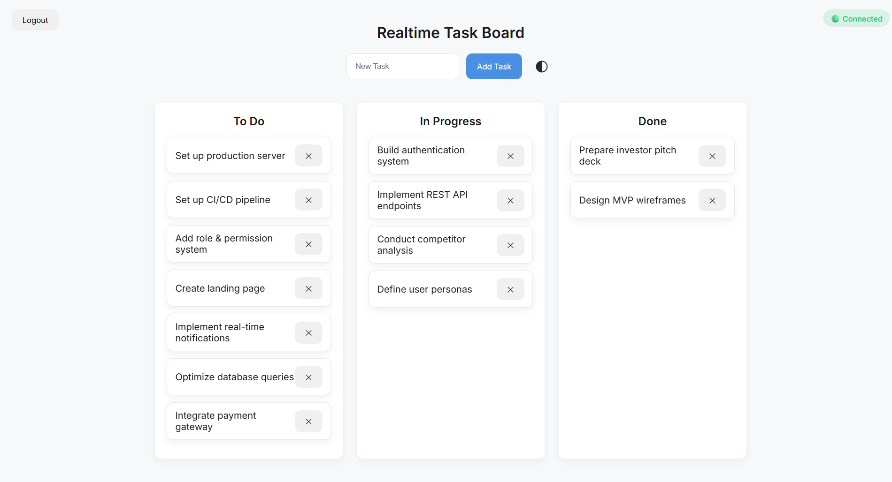
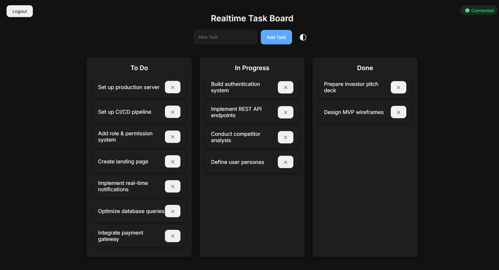
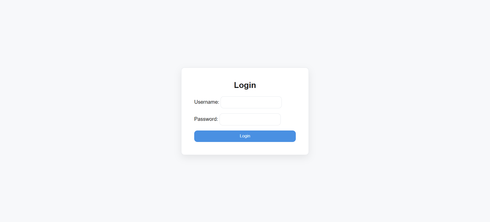

# Realtime Collaboration Engine

### Event-Driven SaaS Infrastructure Foundation

A production-oriented realtime collaboration engine built with Django, WebSockets, Redis, and ASGI.

This project is not a simple task manager demo.
It is being engineered as a scalable SaaS-ready infrastructure capable of powering multi-user collaboration platforms with realtime state synchronization and isolated event streams.

The task board is the first implementation layer — the architecture is the real product.

---

## 📸 Screenshots

### Light Theme

### Dark Theme

### Login

---

## 🎯 Product Vision

The objective is to build a reusable, extensible realtime SaaS foundation capable of supporting:

- Multi-tenant collaboration systems
- Authenticated WebSocket infrastructures
- Persistent Kanban workflows
- Horizontally scalable channel layers
- Modular frontend architecture
- Future subscription-based SaaS expansion

This repository represents the infrastructure layer of a scalable collaboration platform.

---

## 🧠 Core Architecture

Built entirely on ASGI with full separation between HTTP and WebSocket layers.
### Backend Stack

- Django 6
- Django Channels 4
- Redis (channel layer backend)
- Uvicorn (ASGI server)
- Daphne (optional ASGI server)
- Docker (service orchestration)

---

### Communication Flow

Client  
→ WebSocket  
→ Channels Consumer  
→ Redis Channel Layer  
→ Group Broadcast  
→ Connected Clients  

This enables:

- Real-time multi-tab synchronization
- Async event processing
- Horizontal scalability readiness
- Separation of HTTP and WebSocket layers

---

## 🔌 Realtime Engine (Implemented)

- ASGI configuration with `ProtocolTypeRouter`
- WebSocket routing
- Async consumer handling
- Group-based broadcasting
- Redis-backed channel layer
- Static file handling under ASGI
- Dockerized Redis service
- WebSocket auto-reconnect mechanism
- Exponential backoff reconnection strategy
- Connection state detection (open / close / error)
- Authenticated WebSocket connection
- Group-per-user channel architecture
---

## 🎨 Frontend System (Implemented)

- Modular CSS architecture
- Light / Dark theme (persistent via localStorage)
- Drag & Drop task movement
- FLIP animation for smooth reordering
- Spring physics animation engine
- Clean DOM structure
- Scalable UI component styling
- Realtime UI synchronization

---

## 🏗 Current System State

- ✅ WebSocket connection (101 Switching Protocols)
- ✅ Realtime broadcasting
- ✅ Redis-backed channel layer
- ✅ Docker service integration
- ✅ Django authentication system
- ✅ Protected board view
- ✅ Authenticated WebSocket connection
- ✅ Group-per-user channel structure
- ✅ WebSocket auto-reconnect
- ✅ FLIP + Spring animation engine
- ✅ Drag & Drop task movement
- ✅ Clean Git workflow

The system is now operating as an authenticated realtime collaboration engine with per-user isolation and animated state transitions.

---

## 📐 Architectural Direction

The system is being structured with:

- Event-driven design
- Separation of concerns
- Scalable channel grouping
- Per-user isolation
- Modular frontend architecture
- Incremental feature layering
- Clean Git-based workflow

---

## 🛠 Development Status

Active development.

Realtime engine stabilized.
Authentication layer implemented.
Auto-reconnect system operational.
Transitioning into multi-board and role-based architecture expansion.

---

## 🔮 Long-Term Direction

Future possibilities:

- Team-based SaaS deployment
- Board-level multi-tenancy
- Subscription system integration
- Horizontal scaling strategy
- Production cloud deployment architecture